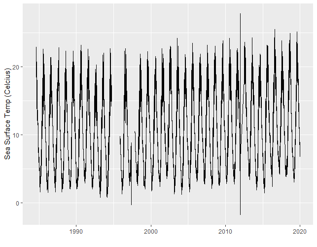

<!-- README.md is generated from README.Rmd. Please edit that file -->

# buoydata

<!-- badges: start -->


<!-- badges: end -->

The goal of `buoydata` is to easily download and process buoy data
hosted by National Data Buoy Center. Note: the
[rnoaa](https://github.com/ropensci/rnoaa) package also has functions to
get buoy data. The difference is that (in
[rnoaa](https://github.com/ropensci/rnoaa)) only one years worth of data
can be downloaded at any time from a single buoy.

`buoydata` downloads multiple years and stitches all years data together
in a single data frame. In addition the lazily loaded station
description data provided with the package combines many more attributes
(than [rnoaa](https://github.com/ropensci/rnoaa)) by which to filter.

*Date of most recent data pull: 2021-01-26*

## Installation

``` r
remotes::install_github("andybeet/buoydata")
```

## Example

Find all buoys located between latitude \[41,43\] and longitude
\[-71,-67\] with a time series of at least 20 years. Then pull and
process data from a single buoy.

``` r
library(buoydata)
library(magrittr)

buoydata::buoyDataWorld %>% dplyr::filter(LAT > 41,LAT < 43) %>%
  dplyr::filter(LON > -71, LON < -69) %>%
  dplyr::filter(nYEARS >= 20)
#>      ID   Y1   YN nYEARS    LAT     LON                      STATION_LOC
#> 1 44013 1984 2019     36 42.346 -70.651 BOSTON 16 NM East of Boston, MA.
#> 2 iosn3 1984 2019     36 42.967 -70.623              Isle of Shoals, NH.
#>   STATION_NAME                       TTYPE TIMEZONE OWNER OWNERNAME COUNTRYCODE
#> 1         <NA> 2.1-meter ionomer foam buoy        E     N      NDBC          US
#> 2         <NA>               C-MAN Station        E     N      NDBC          US
```

``` r
# get the data for buoy 44013
get_buoy_data(buoyid="44013",year=1984:2019,outDir=here::here("output"))

# process sea surface temperature (celcius) into one large data frame
data <- combine_buoy_data(buoyid = "44013",variable="WTMP",inDir = here::here("output"))
```

Then plot the data

``` r
 ggplot2::ggplot(data) +
   ggplot2::geom_line(ggplot2::aes(x=DATE,y=WTMP)) + 
   ggplot2::ylab("Sea Surface Temp (Celcius)") +
   ggplot2::xlab("")
```



#### Legal disclaimer

*This repository is a scientific product and is not official
communication of the National Oceanic and Atmospheric Administration, or
the United States Department of Commerce. All NOAA GitHub project code
is provided on an ‘as is’ basis and the user assumes responsibility for
its use. Any claims against the Department of Commerce or Department of
Commerce bureaus stemming from the use of this GitHub project will be
governed by all applicable Federal law. Any reference to specific
commercial products, processes, or services by service mark, trademark,
manufacturer, or otherwise, does not constitute or imply their
endorsement, recommendation or favoring by the Department of Commerce.
The Department of Commerce seal and logo, or the seal and logo of a DOC
bureau, shall not be used in any manner to imply endorsement of any
commercial product or activity by DOC or the United States Government.*
